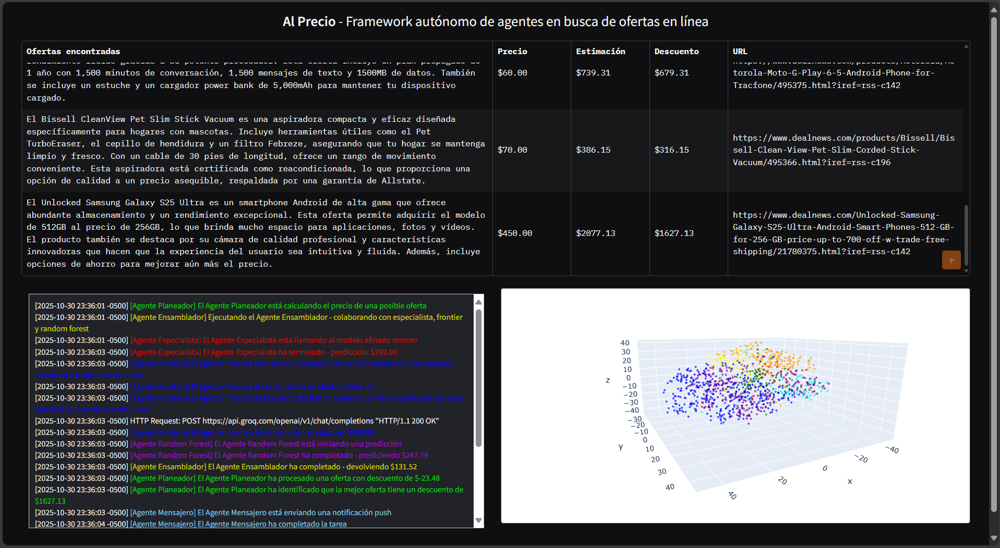
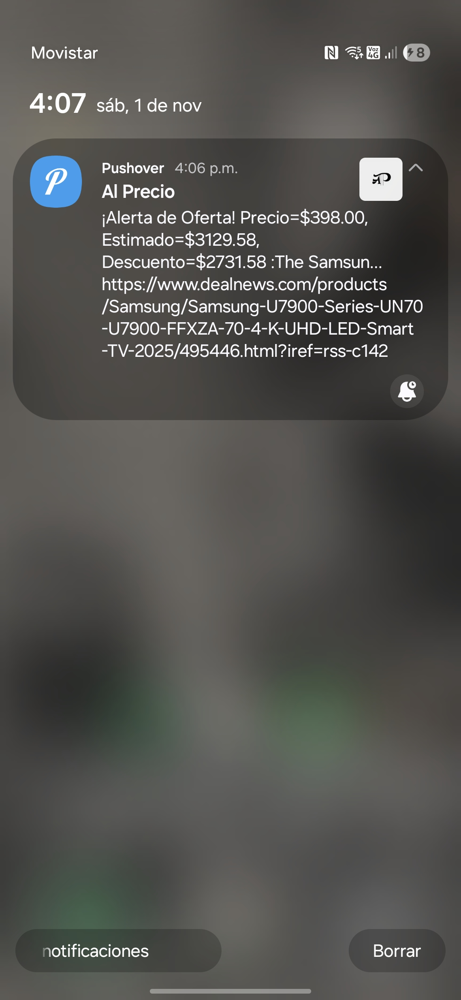

# AlPrecio — sistema modular para estimación y optimización de precios

AlPrecio es un sistema modular desarrollado en Python para la estimación y optimización de precios de productos mediante una orquestación de agentes especializados y modelos predictivos. El diseño prioriza la separación entre la lógica de negocio, los agentes y los servicios externos, lo que facilita la experimentación con pipelines de pricing, el uso de modelos preentrenados y la integración con un vectorstore para búsquedas semánticas y product-matching.

Características principales:
- Arquitectura por agentes (planeador, ensamblador, frontera, mensajero, escáner, especialistas) que permite flujos de decisión complejos y extensibles.
- Integración de modelos predictivos (Random Forest y ensamblado) y uso de un vectorstore (Chroma) para RAG y emparejamiento de productos.
- Interfaz de usuario (Gradio) para interacción rápida y notificaciones push mediante Pushover para alertas en producción/pruebas.
- Separación clara entre código de orquestación (`framework_agentes.py`), runner (`AlPrecio.py`) y agentes concretos (`agentes/`).

Instalación y requisitos
- Clona el repositorio y crea un entorno virtual con los paquetes listados en `requirements.txt` (ya incluido en el repo).
- Se recomienda Python 3.10+.
- Instalar dependencias del entorno y de cargar las variables de entorno antes de ejecutar el runner.

Variables de entorno (obligatorias)
Coloca estas variables en un archivo `.env` en la raíz del proyecto:
OPENAI_API_KEY=<your_openai_api_key>
HF_TOKEN=<your_hf_token_with_Llama_3.3-70B-VERSATILE_access>
GROQ_API_KEY=<your_groq_api_key>
PUSHOVER_USER=<your_pushover_user_key>
PUSHOVER_TOKEN=<your_pushover_app_token>

Modelos y activos externos (Ambos en móduilo src/)
- Modelo RandomForest (.pkl) https://drive.google.com/file/d/1RvRZDe2sPDg12c4lPVQcYvv0WszrUUqF/view?usp=drive_link
- Base de Datos vectorizada https://drive.google.com/drive/folders/1YnAjrvOj3I0UCPniYBOCpIeqpykHhF0R?usp=sharing

Sistema de Notificaciones
- Mediante el servicio Pushover se realiza una notificación a los dispositivos suscritos al canal de mensajería, se notifica cada que la aplicación completa una ejecución

## Nota importante:
Este proyecto fue elaborado a partir del proyecto final del curso "LLM Engineering: Master AI, Large Language Models & Agents" por Ed Donner, y a partir de ese punto se desarrolló y adaptó con trabajo propio para llegar a la versión actual.

